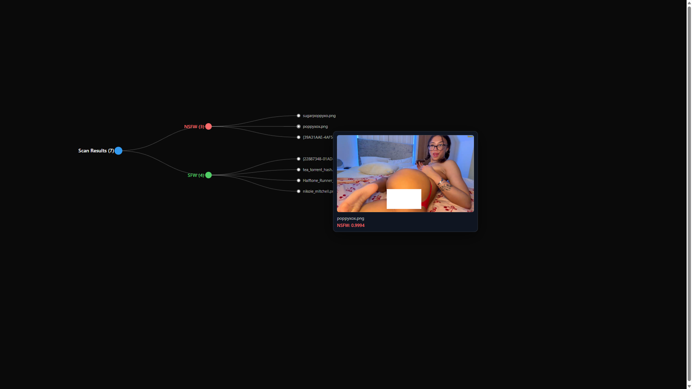

# NSFW Folder Scanner (Falconsai)

Scans a folder of images using the Hugging Face model `Falconsai/nsfw_image_detection` and generates an interactive D3 thumbnail gallery (search, filters, paging, preview modal). Optionally organize files into folders.

## Setup

```powershell
python -m venv .venv
.\.venv\Scripts\Activate.ps1
pip install -r requirements.txt
```

> `torch` can be large; install the right build for your machine (CPU vs CUDA).

## Run

**Default** (scan + generate gallery, recursive by default):

```powershell
python .\scan_nsfw_folder.py "C:\path\to\images"
```

This creates `C:\path\to\images\_nsfw_scan\gallery.html` with an interactive gallery.

### Optional Flags

- `--organize` — Copy/move images into `sfw/` and `nsfw/` folders (default: gallery only)
- `--action move` — Move instead of copy when organizing
- `--threshold 0.7` — Be stricter about NSFW (default: 0.5)
- `--device 0` — Use first CUDA GPU
- `--write-csv` — Also write `_nsfw_scan\report.csv`
- `--no-gallery` — Skip generating the HTML gallery

### Screenshot

 

("**Copyright Notice**: The screenshot contains images of adult performers. All rights to the depicted individuals belong to their respective owners. This screenshot is used for demonstration purposes only to show the software's functionality and is not intended to infringe on any copyrights. If you are the copyright owner and wish this image to be removed, please contact the repository maintainer.") 
